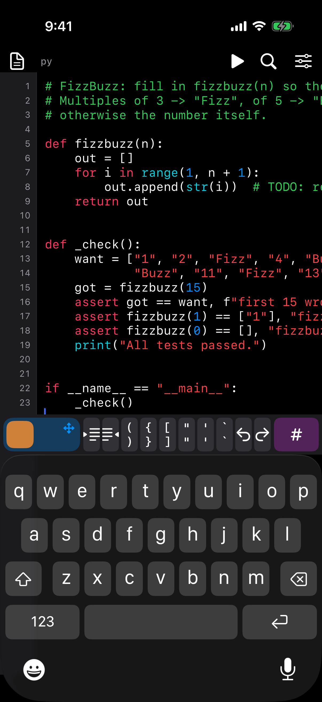
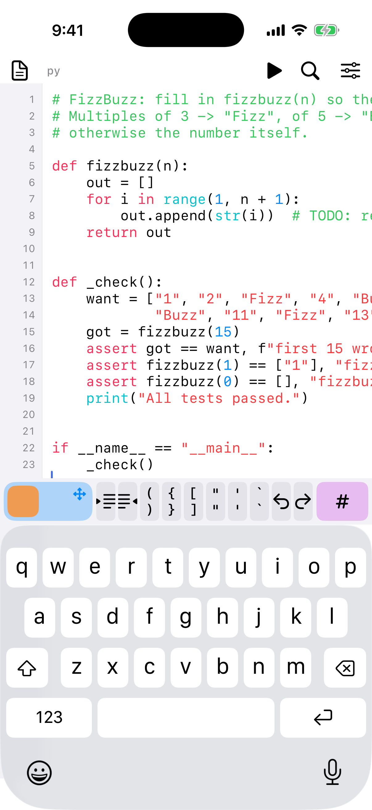

# MobileEditor

Phone-native code editing prototype. Apple's keyboard, with a custom bar for punctuation, caret, selection, and indent.

Not an IDE. No git, files, LSP, or cloud. Open it and type.

## Screenshots

| Dark | Light |
| --- | --- |
|  |  |

Python FizzBuzz with syntax highlighting, `py` language tag, and the Run button in the top chrome.

## Install on iPhone

Autoloader signs the unsigned IPA on-device. Open this on the phone:

https://marginally-better-apps.github.io/Autoloader/?url=https%3A%2F%2Fgithub.com%2FShlok-Bhakta%2Fmobile-code-keyboard-test%2Freleases%2Fdownload%2Fbaseline%2FMobileEditor.ipa

Or direct:

`autoloader://install?url=https%3A%2F%2Fgithub.com%2FShlok-Bhakta%2Fmobile-code-keyboard-test%2Freleases%2Fdownload%2Fbaseline%2FMobileEditor.ipa`

Raw IPA:

https://github.com/Shlok-Bhakta/mobile-code-keyboard-test/releases/download/baseline/MobileEditor.ipa

## Open in Xcode

`MobileEditor.xcodeproj`. Scheme `MobileEditor`. iPhone, iOS 17+.

Unsigned device builds are already configured (`CODE_SIGNING_ALLOWED = NO`). Sign on device with Autoloader or your own cert.

Scratch text autosaves to `Documents/scratch.txt` and comes back on next launch.

## Layout

```
MobileEditor/
  MobileEditorApp.swift          SwiftUI shell
  Editor/
    EditorViewController.swift   screen, find bar, mode state
    CodeTextView.swift           UITextView, code typing traits
    EditorController.swift       move / select / indent / pairs
    TextOperations.swift         string-level edits
    EditorSettings.swift         UserDefaults knobs
    DocumentStore.swift          scratch file
    InputMode.swift
    EditorHaptics.swift
    EditorLog.swift
  Input/
    EditingAccessoryView.swift   bar above the system keyboard
    NavSelectPad.swift           corner SELECT
    HoldButton.swift             SYM hold
  Gutter/LineNumberGutter.swift
  Samples/SampleDocuments.swift
  Settings/DebugSettingsView.swift
```

UI controls call `EditorController`. Don't reach into `UITextView` ranges from buttons.

## Interaction map

No labels. Color is the mode: idle, blue NAV, orange SELECT, purple SYM.

The bar sits on Apple's keyboard. Autocap, autocorrect, smart quotes, and inline prediction are off.

**TYPE** (50 pt bar)

- Indent / outdent icons. Swipe indent left or long-press to outdent.
- Pair keys `() {} [] "" '' ``` wrap or insert-and-nest.
- Undo / redo icons.

**NAV pad** (left, one finger)

Hold the pad. It grows. Orange square sits in the **bottom-left corner** so a thumb can slide into the corner to select.

- Stay off the square: the NAV icons move the caret.
- Slide into the corner: the square grows and sticks. Same icons now extend selection. Leave that bigger region to drop back to move. Selection stays.
- Lift: TYPE. Selection stays.

For free cursor movement, use Apple's spacebar trackpad on the system keyboard.

**NAV layer** (icons while the pad is held)

The bar springs to 108 pt so the two icon rows are easier to hit without eating the editor.

- `« »` word, chevrons char/line, line-start / line-end
- copy, cut, paste, expand (word → line → block → document)

**SYM** (hold `#` on the right)

Keep your thumb down. The bar springs open and the symbol grid takes the middle. Slide onto a glyph: it swells, neighbors scoot, and `#` shows the character. Lift to insert that one. Lift on `#` with no hover and nothing is typed. Positions stay put so you can learn the grid.

**Gutter**

- Tap a line number: select that line.
- Drag vertically: select a line range.

**Find**

- Magnifying glass, or Cmd-F. Next / previous only.

**Return**

- Keeps the current line's indent.
- `{|}` / `(|)` / `[|]` splits into an indented inner line.

**Hardware keyboard**

- Cmd-Z / Shift-Z, C, X, V, A, F.
- Cmd-R runs the buffer.

## Run

The ▶ button in the top chrome runs the whole buffer and shows output in a console sheet: green dot + `Exit 0`, red dot otherwise, spinner while it works. Needs a network connection.

- Runs are executed remotely by Compiler Explorer (pinned compilers: CPython 3.13, rustc 1.98). No keys, no backend of ours.
- The `py` / `rs` / `ts` / `md` tag shows the active language. Picking a sample sets it; Tune can override it. It persists in UserDefaults.
- TypeScript and Markdown don't run in this build — the console says so instead of failing silently.

## Highlighting

Regex-based, per language: keywords, strings, comments, numbers, plus common types and builtins. Applied ~0.35 s after typing stops, attribute-only, so undo history and the caret are untouched. Colors are dynamic system colors, so light/dark just works. The bar itself stays language-blind.

## Tune

Slider icon, top right. Values persist in UserDefaults.

Worth changing on device first:

- Haptics
- Indent width / tabs
- Line wrap
- NAV/SYM delay and momentary vs toggle

Logs go to the Xcode console: `NAV_DOWN`, `SELECT_DOWN`, `MOVE_RIGHT`, `INDENT`, and so on.

## Samples

`Samples` menu: Python, TypeScript, Rust, Markdown. The code samples are FizzBuzz problem packs — a stub plus visible tests that fail until you type the fix. Python and Rust run; TypeScript is highlighting-only for now. Markdown is the prose scratch. Replacing the buffer replaces what autosaves.

## What is in v0

- Code-configured `UITextView` on Apple's keyboard
- Accessory: indent, pairs, undo, NAV, SELECT, SYM
- Smart Return
- Line gutter selection
- Find
- Debug panel
- Light / dark, monospace, almost no chrome
- Run button + console (Python, Rust via Compiler Explorer)
- Syntax highlighting (Python, TypeScript, Rust, Markdown)

## Rough edges

See `EXPERIMENTS.md`. Short version: word movement is not syntax-aware, and the corner SELECT target still needs on-device thumb time.
